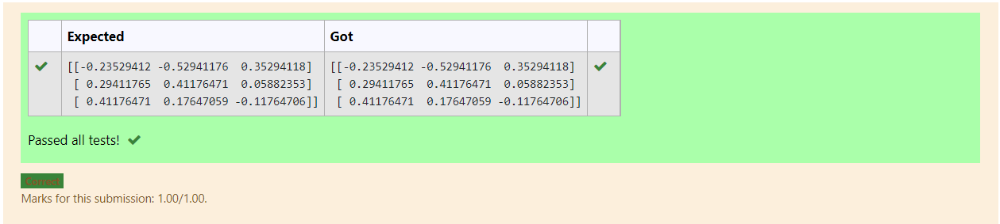

# INVERSE-OF-A-MATRIX
## Aim:
To write a python program to find the inverse of a matrix
## Equipment’s required:
1. 	Hardware – PCs
2. 	Anaconda – Python 3.7 Installation / Moodle-Code Runner
## Algorithm:
### Step1 : import numpy as np
### Step 2: An array is initialized using numpy and stored in variable x.
### Step 3: The array is inversed using the function numpy. linalg. inv(x)
### Step 4:Inversed array is stored in variable y.
### Step 5:Now we'll print both array x and y.
### Step 6: End the program

## Program:
```
import numpy as np
A=np.array([[1,0,3],[-1,2,-2],[2,3,-1]])
print(np.linalg.inv(A))
```
## Output:

## Result:
Thus the inverse of given matrix is successfully solved using python program

